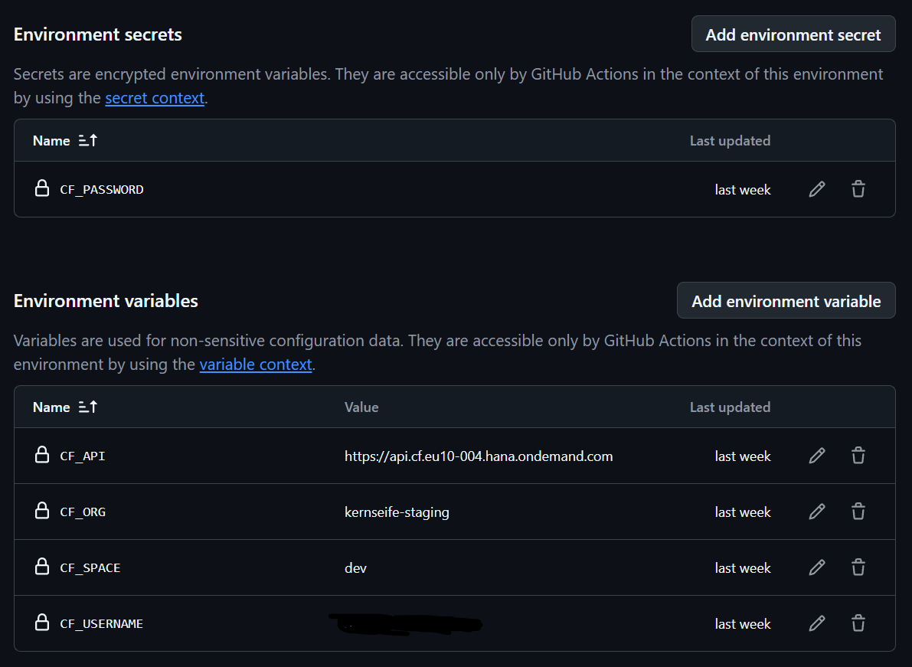
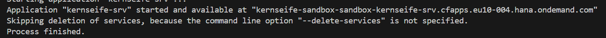

# How to install the Kernseife BTP App

## Prerequisits
* BTP Sub-Account with Cloud Foundry enabled
* min. 2 GB of Application Runtime
* A *HANA Cloud* instance which can be used for a HDI Container
* Subscriptions: SAP Build Work Zone, standard edition - Plan: Standard (Application)
* Following Services (Technical Service Name):
    * SAP HANA Schemas & HDI Containers (hana) - Plan: hdi-shared
    * Authorization and Trust Management Service (xsuaa) - Plan: application (Always Free)
    * HTML5 Application Repository Service (html5-apps-repo) - Plan: app-host (Always Free)
    * Destination Service (destination) - Plan: lite (Always Free)
    * Application Autoscaler (autoscaler) - Plan: standard (Always Free)
    * Cloud Logging (cloud-logging) - Plan: dev (Use Plan "standard" for Production)
The old Applicating Logging Service could also be used, but as Cloud Logging is the successor.<br/>
See more here https://community.sap.com/t5/technology-blog-posts-by-sap/from-application-logging-to-cloud-logging-service-innovation-guide/ba-p/13938380

## Build & Deploy

To deploy to your BTP CF Account, login into cf cli and run:
```
npm install
npm run mbt
```
If you want to install a none-prod environment use:
```
npm run deploy-dev 
```
For a production environment use:
```
npm run deploy-prod
```

> [!NOTE]
> These differentiate between the mta parameters usind a different db service name (to easily spot production tenants, which.. helps not deleting
> those by accident).
> Also production tenants use different service plans (e.g. standard in  cloud-logging).
> Feel free to check and adjust that in your .mtaext files.

We also have a github actions workflow which does build and deploy to a tenant defined via Variables/Secrets.
It is following the guidance based of https://cap.cloud.sap/docs/releases/aug25#continuous-deployments
For this you need to define the Environment in Github with these variables/secrets:


After the deployment is finished the console should show this:


Now you need to assign your user to the "kernseife-admin-${space}" role (depending on the cf space name).

## Setup Workzone
As we don't use a standalone approuter we use the integrated one inside workzone.
Technically you can also use a standalone approuter and a launchpad, but we suggest using workzone as it makes all the role, tile, etc. management way easier.
If your BTP Subaccount doesn't have a Workzone Subscription already, you need to add it.
Make sure your Subbaccount as the Plan "standard (Application)" and not "standard" assigned.
Step 1 of this Guide explains it nicely:
https://developers.sap.com/tutorials/spa-configure-workzone..html

> [!NOTE]
> If you don't have a custom IdP Tenant, I suggest getting one, otherwise the Workzone Subscription might fail.
> As a customer/partner I don't think you can even have a BTP Account without one anyway. Feel free to correct me on this.

Assign yourself the Launchpad_Admin Role

Open the Workzone Application and create a new Site

Go to the Channel Manager and update the HTML5 App Repository

Go to the Content Explorer and add all the Kernseife Apps from the HTML5 Repository

We suggest you create a custom Role and assign the Apps accordingly and not use the "Everyone" Role.
Don't forget to assign your user to that role. Otherwise you will wonder for hours why you can't see any apps. True story.
Also you need to assign the Role to the Site via the Site Studio => Role Assignments

Feel free to now define Groups and assign Apps to them.
We have the Following Groups in our tenant: Manage, Analyze, Configure and Import.
You might be able to figure out which Apps belongs in which group by the App ID (hint: apps starting with "manage" go into the "Manage" Group)

Congratulations, you should now be able to use your Kernseife BTP Tenant!

## Initial Kernseife Setup


